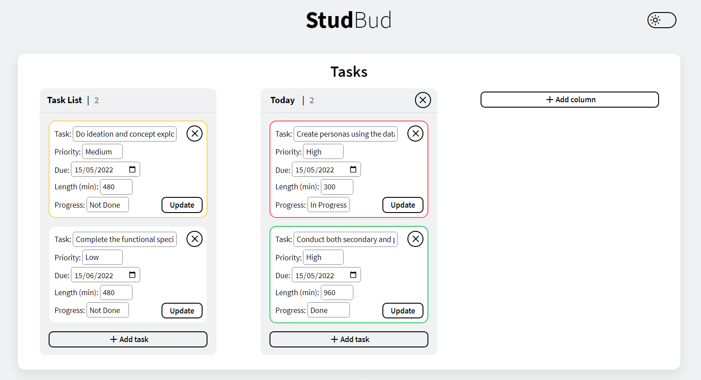
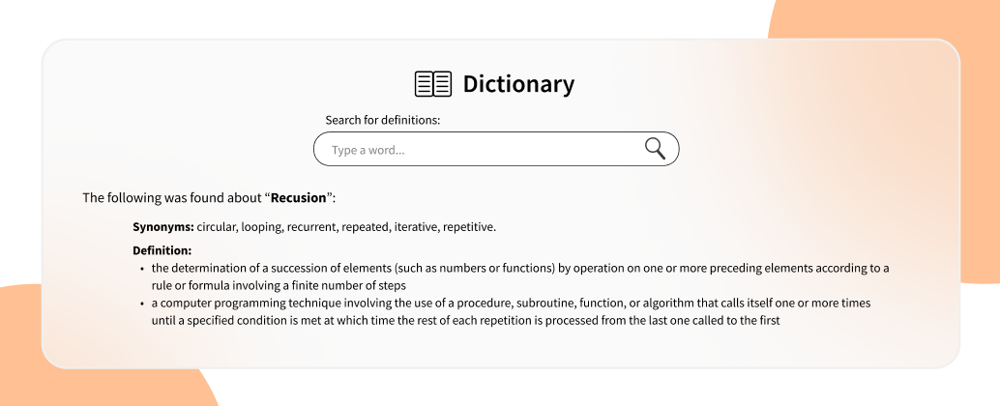

# StudBud

>
StudBud web application

This is a web application for helping students majoring in computer science study better by improving their study
sessions.

This README file goes into great detail about how the application was developed and iterated from the high fidelity
mockup that was designed before the application development began. This process of iteration required extra user
feedback, secondary research about design, usability, and UX principles, as well as self-reflection.

Each part of the application is seperately described below with image comparisons of the mockup and the fully
developed app.

Additionally, the following were used to help with the application development (and their references are in the
bibliography):
- Material Symbols by Google (2022)
- Free Dictionary API by meetDeveloper (2022)
- Embedded Spotify music player by Spotify (2022)

## Task list & Kanban board

>
Mockup of the Kanban board and Task List section

>
Kanban board and Task List section of the developed web application

**User Feedback** 
Users really liked the idea of having a visual cues for showing the priority level for their tasks. As seen in the
mockup, these were blue for low priority, yellow for medium priority, red for high priority, grey for the in progress
button, and green when the task was done. However, they thought that it was a bit too many colours, especially 
with the theme background tan colour as well. Thus, instead of creating a useful visual cue, they did not understand
the meaning of the colours at first and thought it was clustered. One user pointed out that all taks that are not medium
and high priority would be blue based on the mockup. This was solved by using less colours and only
keeping the most important colour cues, which are yellow, red and green and these were only used for the task's outline
to make the kanban board visually more pleasing on top of them being useful for visual cues.

Secondly, users found that it would be a hassle only being able to create new tasks in the Task List column, because
then they would have to do extra action to put a task into another column. This was solved by adding an "Add Task"
button in each column so if users want to create a task for a specific column straight away then they can do so.

Additionally, when users were asked to add additional columns, some did not straight away pick out where they can do
this, which means that the simple plus sign, "+", was not clear enough for this functionality. This was solved by
adding a clearly defined button for the purpose of adding a new column.

**Secondary Research on Design Principles** 
The principles of usability also states that a website/web application should have each features clearly defined to
prevent confusion for users, but instead provide them with an enjoyable user experience through the simplicity and
consistency of design and functionality throughout the application (Claromentis, 2015).

Furthermore, feedback is key for users. Giving either colour, size, text based feedback to users when they do an
action, for example when clicking on a button to close or create a task or a column confirms them that yes they have
successfully performed the action they wanted. Otherwise, they might feel that either the application is broken or they
are incorrectly using the app (Claromentis, 2015).

>
A clicked "Add task" button

To adhere to these principles, the application has a minimalistic feel and look, with consistent design styles like
having clearly defined container sections for the columns and each task to prevent confusion. Furthermore, the use of
icons has been kept very minimal and short word descriptions were used instead to straight away let the user know what
each feature is used for what. On top of that, no features are left hidden, meaning the user is able to delete tasks
and columns straight away as the "x" close buttons are always displayed, so no extra action is needed by the user as
previously in the mockup, users has to click on the three dot icon to bring up such features.

Furthermore, to ensure users feel confirmations with all there actions on web application, each button is interactive
both on hover and on click. Users can see when they are dragging a task and can also see where they can drop the task.
users can see when they are editing a field as the input field has a outline around it. Lastly, users get confirmations
that they have added or deleted a task as the number of the column changes based on how many tasks it contains.

**Self-Reflection** 
I added an extra feature, which I believe users would find useful, the ability to update an already existing task. This
is useful as the progress of a task changes as users work on those tasks. As well as the due date or priority of a task
may also change. Nevertheless, all the other features of a task may change for unforeseen reasons, thus it is useful
to be able to update tasks.

In the development roadmap, I started that the Kanban board and the Task List would be one of the initial features
that will be developed, however due to the complexity. I had to carefully design the architecture for it on the side.
Hence, the other features of the application were developed fully first.

## Pomodoro timer & Stopwatch timer

>
Mockup for both the Pomodoro and Stopwatch sections

>
Both the Pomodoro and Stopwatch sections of the developed web application

**User Feedback** 
Users found it useful that they can start both a Pomodoro timer and a Stopwatch timer simultaneously. However, when they
were informed about how the settings is planned to be developed, meaning it would either have a pop-up window or replace
the Pomodoro timer momentarily, some of them were against the idea and suggested they would much prefer to see the timer
even when they are editing the settings for the Pomodoro. This was solved by momentarily adding the settings section
below the timer when the settings button was pressed and then being able to close that window by clicking the settings
button again.

**Secondary Research** 
There has been a debate about using "..." icons in the design field. It initially appeared in software to indicate that 
there is extra text that cannot be displayed on the screen. Over the years it has turned into an icon that symbolises
more than just its initial use case. It is also used for typing animation on mobile phones, as well as
revealing additional hidden features. Only in recent years it started becoming more popular but has not been
fully widespread and recognised in comparison to other icons (Carlin, 2021).
A good design at its core has clarity and one of the ways to achieve it is by creating familiarity to the user 
(Idler, 2021).

Due to these secondary research findings, the three dot icon was changed to a cogwheel to make the settings of the
Pomodoro timer more recognisable for users as they will have a sense of familiarity about what the cogwheel is for.

>
Pomodoro Settings after the cogwheel has been pressed

**Self-Reflection** 
I believe it was unnecessary to have title saying "Timers" as seen in the mockup, which contains both the Pomodoro and
the Stopwatch, but instead have a clear separation between the features by putting them in their own container and 
making their title the same since as "Tasks" for consistency as each of these white containers represent a feature.
As previously mentioned in the Kanban secondary research section, consistency is key for great user experience 
(Claromentis, 2015). So another change in order to stay consistent throughout the web application was done by replacing
the icon buttons with buttons that have the same style that were seen in the kanban board.

An extra feature improvement I added based on self reflection was the colour change for the timers, which gives a visual
cue to the user but also gives them confirmation about pressing the buttons for both timers work as intended, which is
an extremely important design principle as mentioned earlier (Claromentis, 2015).

>
Pressing the start button for both the Pomodoro and Stopwatch

>
Pressing the stop button for both the Pomodoro and Stopwatch

>
Pressing the reset button in dark mode for both the Pomodoro and Stopwatch

## Dictionary

>
Mockup for the Dictionary section

>
Dictionary section of the developed application

**User Feedback** 
From user feedback it was found that users would to see multiple dictionary searches at once, meaning old searches
should be shown until users get rid of them. This was solved by doing exactly that; each search has its own container,
which can be closed whenever the user does not need the information anymore.

**Secondary Research on Design Principles** 
Secondary research shows that the best practices for a form need labels for each input field, these fields show be clearly
distinguishable from other elements on the page, no all caps for labels, placeholders should guide the user, and also
show errors when something goes wrong (Coyle, 2021).

Exactly why, the form did not change much except some minor changes because it was already following good design
principle standard. However, the search button was changed from an icon to a button with the text "Search" in it
to make it consistent with the rest of the button on the web application.

Additionally, I added statements when there is no definition result found and when there are no synonyms found
for the searched word, which adheres to the secondary research found.

**Self-Reflection** 
Upon self-reflection, I thought it would be a nice touch to show what the word's type is for each definition, for example
verb, noun, adjective, or other.

Furthermore, the size of the Dictionary section as well as the Music Player section was decreased to be the same
width as the width of the Pomodoro or the Stopwatch because initially in the mockup it took up unnecessary space
even though it could be fit into a smaller container.

>
No synonyms and no definition results are displayed

## Music player

>
Mockup for the Music player section

>
Music player section of the developed application

**User Feedback** 
Users were asked about what music streaming service they use, to gather insight about what type of embedded music player
should be placed into the StudBud web application. Majority said they use Spotify, also it's important to note that
some of them used to use different music streaming services but have switched to Spotify over the years.

**Secondary Research** 
Additionally, secondary sources were looked at and it was determined that Spotify is the most used music
streaming service worldwide base on the number of downloads it had (Sensor Tower, 2019).

As a result of both user feedback and secondary research, a Spotify music player was embedded into the application, thus
users will be able to log into Spotify and listen to the full length of each song and not just the 30 second preview 
version of each song. Furthermore, since the music is for studying purposes, a study music playlist was selected to be
embedded into the music player, thus allowing students to get the most out of their studies.

**Self-Reflection** 
Since a light/dark mode option was implemented for the whole web application, I also made sure that the music player's
colour theme also changed between light and dark mode, however the only downside is that when switching between
light/dark mode, the music stops since the source link is changed for the music player. 

>
Music player section of the developed application in dark mode

# Bibliography
Carlin, J. (2021). The enigmatic ellipsis — and why we see it on every UI. Medium. Retrieved from https://uxdesign.cc/dot-dot-dot-7ce6170bfc7f

Claromentis. (2015). The principles of usability. Medium. Retrievied from https://medium.com/@Claromentis/the-principles-of-usability-1c12c6b4fe16

Coyle, A. (2021). Form design best practices. Medium. Retrievied from https://medium.com/nextux/form-design-best-practices-9525c321d759

Google. (2022). Introducing Material Symbols. Retrieved from https://fonts.google.com/icons?icon.style=Rounded

Idler, S. (2021). 5 Key Principles Of Good Website Usability. The Daily Egg. Retrieved from https://www.crazyegg.com/blog/principles-website-usability/

meetDeveloper. (2022). Free Dictionary API. Retrieved from https://github.com/meetDeveloper/freeDictionaryAPI

Sensor Tower. (2019). Top Music Apps Worldwide for September 2019 by Downloads. Retrieved from https://sensortower.com/blog/top-music-apps-worldwide-september-2019

Spotify. (2022). Study Music 2022. Retrieved from https://open.spotify.com/playlist/471N195f5jAVs086lzYglw